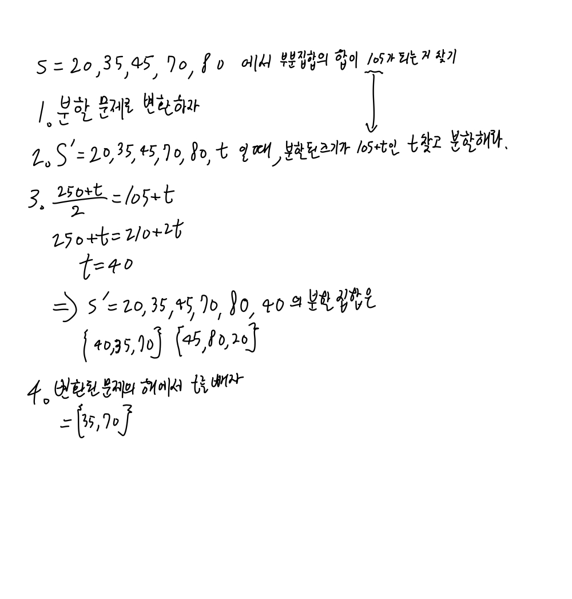

# DSA
- Time/Space complextity
- NP problem
- Data structure
- Algorithm

## Complexity
- time complexity : 거대한 미지수에 대한 연산 횟수만 고려
기본적인 연산 횟수(비교, 할당, 계산, R/W 등)를 입력 크기인 n단위로 표현
알고리즘의 효율성을 나타내는 지표
최악과 평균의 경우만 생각
계수 생략, 차수에 대해서만 고려
시간 복잡도를 쓰는 이유는 거대한 시스템에서 n이 충분히 클 때의 상황을 보려는 것. 따라서 계수의 영향이 미미.
=> 즉, 미지수에 대한 연산 횟수만 고려한다!

- space complexity
사용되는 메모리 크기

- 지표 표기법
1. big oh : O(n), 상한선
2. big omega : Ω(n), 하한선
3. big theta : Θ(n), 유사한 증가율

- 각 지표 별 유도
두 함수 f(x), g(x)가 모든 x(≥ x0)에 대하여 (상수 n)
Big oh : f(x) ≤ ng(x) 인 n과 x0가 존재 -> f(x)=O(g(x))
    -> (x0, ∞)에서 f(x)이 ng(x)의 값을 절대 넘지 못한다.
    -> 상한
Big omega : f(x) ≥ ng(x) 인 n과 x0가 존재 -> f(x)=Ω(g(x))
Big theta : ng(x) ≥ f(x) ≥ mg(x) 인 n, m, x0가 존재 -> f(x) = Θ(g(x))

- 자주 사용되는 함수 별 그래프

입력 크기 n에 대해 sin(n) + 1의 θ 표기를 구할 수 있는가? 그 이유를 설명하시오.

## NP problem
#### summary
p-time
NP problem
ㄴ P problem
ㄴ NP-complete problem
NP-hard problem

- deterministic
deterministic algorithm : 같은 입력에 대해 항상 같은 결과를 출력하는 알고리즘
Nondeterministic algorithm : 같은 입력일지라도 출력 결과가 다른 알고리즘. 즉 답이 하나로 정해져있지 않음.

- polynomail time.
O(n^k * log_l(n))처럼 T.C를 다항식 시간으로 표현 가능한 시간

#### NP
non-deterministic p-time problem.
1. 문제를 p-time 내에 해결할 알고리즘이 없는 문제.
2. solution이 주어졌을 때, 이 문제의 정답이 solution이 맞는지 p-time 내에 검증 가능한 문제 
= 해당 문제를 decision problem으로 표현할 수 있고, p-time 내에 해결 가능하다.

#### P
p-time problem
deterministic 알고리즘으로 p-time 내에 풀리는 문제 (ex|지금까지의 대부분 문제)

#### NP complete problem
1. 문제가 p-time 내로는 해결할 수 없고, 일반적으로 exponential time이 걸리는 문제.
-> 근사, 확률, 휴리스틱 등의 방법으로 정답에 가까운 해는 찾을 수 있음.
2. solution이 주어졌을 때, 이 문제의 정답이 solution이 맞는지 p-time 내에 검증 가능한 문제 
-> 해당 문제를 decision problem으로 표현할 수 있고, p-time 내에 해결 가능하다.
3. 모든 NP 문제는 p-time 내에 모든 NP-complete 문제로 변환 가능하다.

=> NP complete = NP & NP-hard

- reduction
1. 변환할 문제 B 결정
2. 문제 A의 입력을 문제 B의 입력으로 변환
3. 문제 B 해결 -> 이 단계의 T.C가 NP complete problem의 T.C를 결정
4. 문제 B의 해를 문제 A의 해로 변환

- 예제

#### NP hard problem
NP에 속하는 모든 문제들과 어렵거나 그 이상. 따라서 NP 문제일 수도 있고 아닐 수도 있음.
모든 NP hard 문제가 어떤 다른 NP hard 문제로 변환될 수 있다.

#### decision problem
answer가 yes or no인 문제.

- 변환 과정
1. 도출할 결과를 yes or no로 변환
2. 입력 변환
3. 알고리즘 구현
4. T.C 도출
5. NP-problem 여부 결정

- 예제 : 0-1 knapsack problem의 경우
1. 0-1 knapsack problem -> 가치합이 V 이상인 경우가 있는가?
2. 1의 문제, 물건 목록 item_1 ~ item_n
3. for i in len(items)
    if sum(w_1 ~ w_i) <= W
        if sum(v_1 ~ v_i) >= V
            return yes
4. weight 계산 최대 n번 + value 계산 최대 n번 = O(n+n)
5. p-time이 도출되었으므로 0-1 knapsack은 NP-problem이다.

## Data Structure
- array, linked list
-> two pointer, sliding window
투 포인터 알고리즘의 일반적인 수행 절차
① 리스트의 시작 위치에 첫 번째 포인터와 두 번째 포인터를 설정
② 두 포인터 사이의 구간 내 데이터를 조사하고 조건을 확인
➢ 조건을 만족할 경우, 원하는 결과를 얻었으므로 알고리즘을 종료
➢ 조건을 만족하지 않을 경우, 첫 번째 또는 두 번째 포인터를 이동
③ 다시 2번 단계로 돌아가 반복
④ 포인터가 리스트의 범위를 벗어나면 알고리즘을 종료
- stack
LIFO
DFS, back tracking, recursion
- queue
FIFO
BFS, 대기열, 순차 처리
- matrix, Grid
- hash

- heap
binary heap? -> index만으로 트리구성가능
➢ 이진 힙 (Binary Heap)
– 힙 조건을 만족하는 완전 이진 트리 (Complete Binary Tree)
– 힙 조건: 각 노드의 우선 순위(priority)가 자식 노드의 우선 순위보다 높다.
– 최대 힙(Maximum Heap): 가장 큰 값이 루트에 저장
– 최소 힙(Minimum Heap): 가장 작은 값이 루트에 저장
- string
- graph, tree
- set
- map 

## Algorithm
##### divide & conquer
divide input(size n) -> subproblem(n/b) * a  
conquer : 문제를 해결  

1. merge sort : for linked list, multi processor 병렬화
2. quick sort : good for large input
3. insert sort
4. binary search
5. select problem(value search) : find median at data analyzation
6. closest pair

- 고려 사항
1. 부적절한 경우
input < sum of sub problem's input 일 때
Ex | n 번째의 피보나치 수를 구하기 - 사실상 n의 값 자체가 입력 크기이므로
2. 문제 특성 상 취합 과정이 효과적일 수 있다.
Ex | most of geometry problem

##### greedy
가능한 해들 중에서 가장 좋은 (최대 또는 최소) 해를 찾는다 -> 최적화
근시안적 선택 : 데이터 간 관계 고려 X, 선택 시 번복 X
greedy하게 선택할 값 결정 
-> 이 값이 최소값(비용의 경우) 또는 최대값(이익의 경우)이 되는 값 찾기

1. minimum spanning tree
2. shortest path
3. fractional Knapsack : 최소의 비용으로 자원을 할당
4. set cover
5. job scheduling 
6. Huffman compression

##### dynamic programming
input size가 작은 sub problems 해결
–> 그 해들을 "이용"하여 큰 sub problems 해결
–> 최종적으로 이 해들을 이용해 원래 문제 해결
-> 체계적인 solution 설계 가능 but TC 증가
기본적으로 모든 경우의 해를 구하되, 이전에 구한 해는 다시 계산하지 않음.

1. All Pairs Shortest Paths
2. chained multiplex mul
3. edit distance
4. 0-1 knap problem

##### Searching
##### Sorting
- sort 폴더 참조
##### Bitwise
##### Recursion
##### Mathmatical
##### Geometric
##### Backtracking
##### Approximation
NP-complete problem의 solution은 보통 exponential time이 걸린다.
대신 p-time 내에 찾을 수 있는 approximated solution을 찾는다.
이는 approximation ratio를 산출하여 같이 제출하여야 한다.

- approximation ratio
근사 해 / 최적 해 -> 최적 해를 모르므로 간접적 최적 해 사용
근사 해 / 간접적 최적 해
정답 = 최적 해
간접적 최적 해 <= 최적 해
근사 해 <= 간접적 최적 해

TSP : vertex 다찍고 복귀

실제 문제(현실에서의 문제) 
-> 그 문제를 p-time내에 해결 가능하도록 모델링
(ex| 현실 path를 그래프로 만들되, geometric한 특성(직행 루트가 경유 루트보다 짧음 등) 등의 특징 반영)
-> 해답 도출. T.C는 최적 T.C와 같아야 함?
-> 실제 문제에 적용

근사비용 도출
최적 해 : OPT_o -> 실질적으로 알 수 없다.
간접적 최적 해 : OPT -> 최적 해 대신 사용한다. OPT <= OPT_o
근사 알고리즘으로 구한 해 : OPT' -> 사용할 알고리즘으로 도출한 실제적인 해.

- approximate vertex cover

 

### Find answer
백트래킹 기법
분기 한정 기법
-> 정확한 최적 해 찾는다

유전자 알고리즘
모의 담금질 기법
-> 최대한 좋은 해를 찾는다

##### 백트래킹
update best solution
stop condition
    if current's cost > best cost -> stop
recursive control

genetic
큰구조는 간단하나 구현 시 생각은 많이 해야 함.
early stop 필요

# 적용 분야 모음
SAT (Satisfiability)
➢ 반도체 칩 (Chip)을 디자인하는 전자 디자인 자동화 (Electronic Design Automation)
➢ 소프트웨어에 핵심적인 부분인 형식 동치 관계 검사 (Formal Equivalence Checking)
➢ 모델 검사 (Model Checking)
➢ 형식 검증 (Formal Verification)
➢ 자동 테스트 패턴 생성 (Automatic Test Pattern Generation)
➢ 인공 지능에서의 계획 (Planning)과 명제 모델을 컴파일하는 지식 컴파일 (Knowledge
Compilation)
➢ 생물 정보 공학 분야에서 염색체로부터 질병 인자를 추출 또는 염색체의 진화를 연구하는데
사용되는 단상형 추론 (Haplotype Inference) 연구
➢ 소프트웨어 검증 (Software Verification)
➢ 자동 정리 증명 (Automatic Theorem Proving) 등
- 19 -
부분 집합의 합 (Subset Sum)
➢ 암호 시스템 개발에 사용되는데, 그 이유는 문제 자체는 얼핏 보기에 매우 쉬우나
해결하기는 매우 어렵기 때문이다.
➢ 실용적인 전자 태그 암호 시스템 (RFID Cryptosystem)
➢ 격자 기반 (Lattice-based) 암호화 시스템
➢ 공개 암호 시스템 (Public Key Cryptography)
➢ 컴퓨터 패스워드 (Password) 검사 및 메시지 검증
➢ 음악에도 적용하여 스마트폰 앱으로도 만들어진 사례도 있다.
- 20 -
분할 (Partition)
➢ 분할 문제를 보다 일반화하여 분할할 부분 집합 수를 2개에서 k개로 확장시키면,
더욱 더 다양한 곳에 응용 가능
➢ Switching Network에서 채널 그래프 비교
➢ 시간과 장소를 고려한 컨테이너의 효율적 배치
➢ 네트워크 디자인
➢ 인공 지능 신경망 네트워크 (Artificial Neural Network)의 학습
➢ 패턴 인식 (Pattern Recognition)
➢ 로봇 동작 계획 (Robotic Motion Planning)
➢ 회로 및 VLSI 디자인
➢ 의학 전문가 시스템 (Medical Expert System)
➢ 유전자의 군집화 (Gene Clustering) 등
- 21 -
0-1 배낭 (Knapsack)
➢ 다양한 분야에서 의사 결정 과정에 활용된다.
➢ 원자재의 버리는 부분을 최소화하는 분할
➢ 금융 분야에서 금융 포트폴리오 선택
➢ 자산 투자의 선택
➢ 주식 투자
➢ 다차원 경매 (Combinatorial Auction)
➢ 공개키 암호시스템인 Merkle–Hellman Knapsack Cryptosystem
➢ 게임 스도쿠 (Sudoku) 등
- 22 -
정점 커버 (Vertex Cover)
➢ 집합 커버 문제의 특별한 경우이다.
➢ 부울 논리 최소화 (Boolean Logic Minimization)
➢ 센서 (Sensor) 네트워크에서 사용되는 센서 수의 최소화
➢ 무선 통신 (Wireless Telecommunication)
➢ 토목 공학 (Civil Engineering)
➢ 전기 공학 (Electrical Engineering)
➢ 최적 회로 설계 (Circuit Design)
➢ 네트워크 플로우 (Network Flow)
➢ 생물 정보 공학에서의 유전자 배열 연구
➢ 미술관, 박물관, 기타 철저한 경비가 요구되는 장소의 경비 시스템 -
CCTV 카메라의 최적 배치 (Art Gallery 문제) 등
- 23 -
집합 커버 (Set Cover)
➢ 집합 커버 문제의 응용은 정점 커버 문제의 응용을 포함
➢ 비행기 조종사 스케줄링 (Flight Crew Scheduling)
➢ 조립 라인 균형화 (Assembly Line Balancing)
➢ 정보 검색 (Information Retrieval)
➢ 도시 계획 (City Planning)에서 공공 기관 배치하기
➢ 컴퓨터 바이러스 찾기 (virus signature)
➢ 기업의 구매 업체 선정
➢ 기업의 경력 직원 고용 등
- 24 -
- 25 -
- 26 -
그래프 색칠하기 (Graph Coloring)
➢ 생산 라인, 시간표 등의 스케줄링
➢ 무선 네트워크에서 주파수 할당 (Bandwidth Allocation)
➢ 컴파일러의 프로그램 최적화
➢ 패턴 인식
➢ 데이터 압축 (Data Compression)
➢ 스도쿠 (Sudoku) 게임: 81개의 점이 있는 그래프에서 9개의 색으로 점을
색칠하기와 동일하다.
➢ 생물학에서 생체 분석
➢ 고고학 자료 분석에 응용
- 27 -
최장 경로 (Longest Path), 여행자 (Traveling Salesman) 문제, 헤밀토니안 사이클
(Hamiltonian Cycle)
➢ 운송 및 택배 사업에서의 차량 운행 (Vehicle Routing)
➢ 가전 수리 및 케이블 회사에서의 서비스 콜의 스케줄링
➢ 회로 기판에 구멍을 뚫기 위한 기계의 스케줄링
➢ 회로 기판에서의 배선 (Wiring)
➢ 논리 회로 테스트
➢ 건축 시공에서의 배관 및 전선 배치,
➢ 데이터의 군집화 (Clustering) 등
- 28 -
통 채우기 (Bin Packing)
➢ 다중 처리 장치 (Multiprocessor) 스케줄링
➢ 멀티미디어 저장 장치 시스템
➢ Video-on-Demand 서버의 비디오 데이터 배치 등의 자원 할당 (Resource Allocation)
➢ 생산 조립 라인에서의 최적화
➢ 산업 공학, 경영 공학의 주요 분야인 공급 망 경영 (Supply Chain Management)
➢ 트럭, 컨테이너에 화물 채우기
➢ 재료 절단 (Cutting Stock) 문제
➢ 작업의 부하 균등화 (Load Balancing)
➢ 스케줄링 (Scheduling)
➢ 프로젝트 경영 (Project Management)
➢ 재무 예산 집행 계획 (Financial Budgeting) 등
- 29 -
작업 스케줄링 (Job Scheduling)
➢ 컴퓨터 운영 체제의 작업 스케줄링 & 다중 프로세서 (Multiprocessor) 스케줄링
➢ 웹 서버 (Web Server)에서 사용자 query 처리
➢ 주파수 대역 스케줄링 (Bandwidth Scheduling)
➢ 시간표 작성 (Timetable Design)
➢ 항공 산업에서 공항 게이트 (Gate) 스케줄링
- 30 -
요약
➢ NP-완전 문제의 특성은 어느 하나의 NP-완전 문제에 대해서 다항식 시간의
알고리즘을 찾아내면, 모든 다른 NP-완전 문제도 다항식 시간에 해를 구할
수 있다.
➢ 다항식 시간 복잡도를 가진 알고리즘으로 해결되는 문제의 집합을 P
(Polynomial) 문제 집합이라고 한다.
➢ 어느 문제 A에 대해서, 만일 모든 NP 문제가 문제 A로 다항식 시간에 변환
이 가능하다면, 문제 A는 NP-하드 문제이다.
➢ 문제 A가 NP-완전 문제가 되려면, 문제 A는 NP 문제이고 동시에 NP-하드
문제여야 한다.