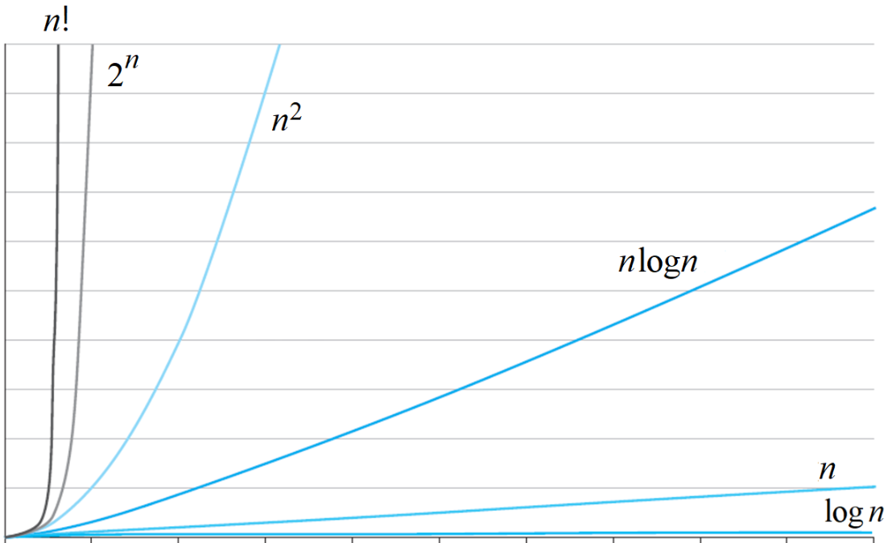

# DSA

### Complexity
- time complexity : 거대한 미지수에 대한 연산 횟수만 고려
기본적인 연산 횟수(비교, 할당, 계산, R/W 등)를 입력 크기인 n단위로 표현
알고리즘의 효율성을 나타내는 지표
최악과 평균의 경우만 생각
계수 생략, 차수에 대해서만 고려
시간 복잡도를 쓰는 이유는 거대한 시스템에서 n이 충분히 클 때의 상황을 보려는 것. 따라서 계수의 영향이 미미.
=> 즉, 미지수에 대한 연산 횟수만 고려한다!

- space complexity
사용되는 메모리 크기

- 지표 표기법
1. big oh : O(n), 상한선
2. big omega : Ω(n), 하한선
3. big theta : Θ(n), 유사한 증가율

- 각 지표 별 유도
두 함수 f(x), g(x)가 모든 x(≥ x0)에 대하여 (상수 n)
Big oh : f(x) ≤ ng(x) 인 n과 x0가 존재 -> f(x)=O(g(x))
    -> (x0, ∞)에서 f(x)이 ng(x)의 값을 절대 넘지 못한다.
    -> 상한
Big omega : f(x) ≥ ng(x) 인 n과 x0가 존재 -> f(x)=Ω(g(x))
Big theta : ng(x) ≥ f(x) ≥ mg(x) 인 n, m, x0가 존재 -> f(x) = Θ(g(x))

- 자주 사용되는 함수 별 그래프

입력 크기 n에 대해 sin(n) + 1의 θ 표기를 구할 수 있는가? 그 이유를 설명하시오.

### Data Structure
- array, linked list
- matrix, Grid
- stack
- queue
- hash
- heap
- string
- graph, tree
- set
- map 

### Algorithm
##### divide & conquer
- feature
divide input(size n) -> subproblem(n/b) * a  
conquer : 문제를 해결  

- 종류
    1. merge sort : for linked list, multi processor 병렬화
    2. quick sort : good for large input
    3. insert sort
    4. binary search
    5. select problem(value search) : find median at data analyzation
    6. closest pair

- 고려 사항
1. 부적절한 경우
input < sum of sub problem's input 일 때
Ex | n 번째의 피보나치 수를 구하기 - 사실상 n의 값 자체가 입력 크기이므로
2. 문제 특성 상 취합 과정이 효과적일 수 있다.
Ex | most of geometry problem
##### greedy
- feature
가능한 해들 중에서 가장 좋은 (최대 또는 최소) 해를 찾는다 -> 최적화
근시안적 선택 : 데이터 간 관계 고려 X, 선택 시 번복 X
greedy하게 선택할 값 결정 
-> 이 값이 최소값(비용의 경우) 또는 최대값(이익의 경우)이 되는 값 찾기

- minimum spanning tree
- shortest path
- fractional Knapsack : 최소의 비용으로 자원을 할당
- set cover
- job scheduling 
- Huffman compression
##### dynamic programming
- feature
input size가 작은 sub problems 해결
–> 그 해들을 "이용"하여 큰 sub problems 해결
–> 최종적으로 이 해들을 이용해 원래 문제 해결
-> 체계적인 solution 설계 가능 but TC 증가
기본적으로 모든 경우의 해를 구하되, 이전에 구한 해는 다시 계산하지 않음.

- All Pairs Shortest Paths
- chained multiplex mul
- edit distance
- 0-1 knap problem
##### Searching
##### Sorting
##### Bitwise
##### Recursion
##### Backtracking
##### Mathmatical
##### Geometric